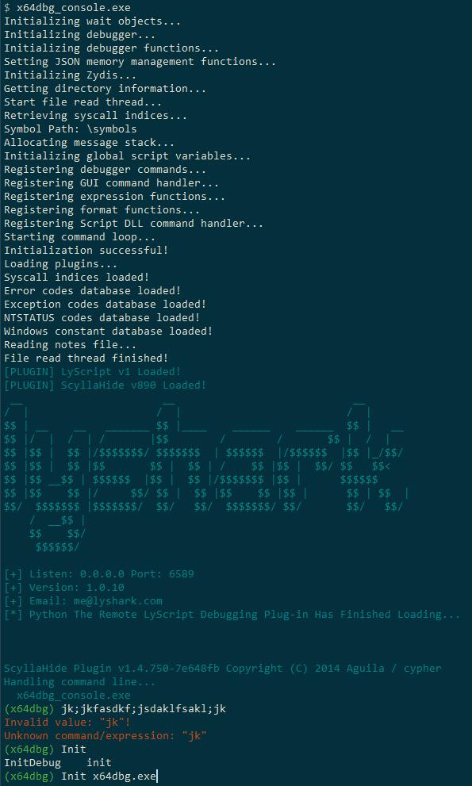

# x64dbg console
Run [x64dbg](https://github.com/x64dbg/x64dbg) in the console.

It's basically useless, as [mrexodia](https://github.com/x64dbg/x64dbg/issues/2201) said: x64dbg is not gdb and will never be because it's designed with a very different philosophy.

But you can use it with some remote script plugin, like [x64dbgpy3](https://github.com/nblog/x64dbgpy3) or [LyScript](https://github.com/lyshark/LyScript).

## Installation 
Put x64dbg_console.exe with x64dbg.exe together.

Put x32dbg_console.exe with x32dbg.exe together.

## Third part libraies
[Crossline](https://github.com/jcwangxp/Crossline) for readline

## Screenshot
